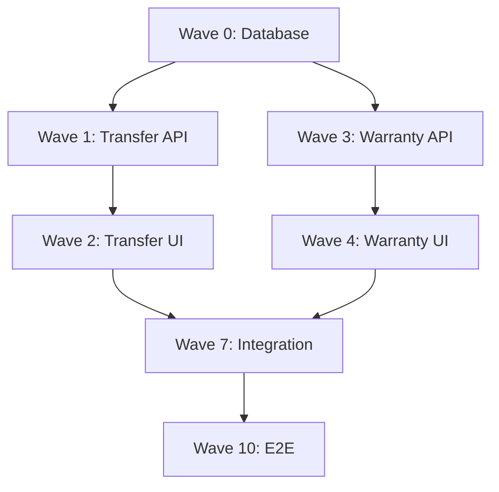

# Wave Planning Guide

**Document ID**: WPG-CANON-001  
**Version**: 2.0.0  
**Date**: 2026-01-09  
**Status**: Active  
**Authority**: Maturion Foreman Governance  
**Referenced In**: FM_PREAUTH_CHECKLIST.md, BL-018, BL-019, BUILD_PHILOSOPHY.md

---

## Purpose

This guide defines the **mandatory process for wave planning** in Build-to-Green implementations. Wave planning is the strategic decomposition of QA-to-Red test suites into logical, sequenced implementation waves that enable systematic progression from Red (all tests failing) to Green (all tests passing).

**FM Authority**: Wave planning is an FM-exclusive authority that MUST be completed and approved before any builder assignment occurs.

---

## Constitutional Principle

**From BUILD_PHILOSOPHY.md**:
> "Wave planning is strategic, not tactical. Waves are carefully sequenced to build foundation before features, manage dependencies, and deliver value incrementally."

**From BL-018 (Bootstrap Learning)**:
> "Wave planning MUST verify QA Catalog alignment before wave assignment. Assigning waves without QA verification is catastrophic."

**From BL-019 (Bootstrap Learning)**:
> "Forward-scan ALL waves after creating ratchet. Second-time failures of same pattern are preventable."

**One-Time Build Law**:
> "Plan the build once, execute once. Poor wave planning creates rework."

---

## 1. Wave Planning Overview

### 1.1 What is Wave Planning?

**Wave Planning** is the FM process of:
1. Analyzing frozen architecture and QA Catalog
2. Identifying implementation dependencies
3. Grouping test cases into logical waves
4. Sequencing waves based on dependencies
5. Validating QA-Catalog-Alignment (BL-018/BL-019)
6. Estimating wave effort and timeline
7. Creating wave definitions for builder assignment

### 1.2 Wave Definition

A **Wave** is a logical grouping of test cases (QA-IDs) that:
- Share a common objective (e.g., "Build Transfer API")
- Target related architecture components
- Can be implemented by a single builder or builder type
- Have clear dependencies (what must be complete before this wave)
- Have measurable completion criteria (all wave tests GREEN)
- Represent 1-7 days of implementation effort (typical)

**Example Wave**:
```
Wave 1: Internal Transfer API Implementation
- QA-IDs: QA-026 to QA-035 (10 tests)
- Objective: Implement all Internal Transfer API endpoints
- Components: API.InternalTransfers, Service.InternalTransferService
- Depends On: Wave 0 (Database Foundation)
- Blocks: Wave 2 (Transfer UI)
- Builder Type: API Builder
- Duration: 3-4 days
```

### 1.3 Wave Hierarchy

**Wave Types**:
1. **Foundation Waves** (Wave 0, Wave 0.x): Infrastructure, database schema, test infrastructure
2. **Feature Waves** (Wave 1, Wave 2, etc.): Core features and functionality
3. **Integration Waves** (Wave N): External service integrations
4. **Polish Waves** (Wave N+1): Performance, optimization, edge cases
5. **Final Waves** (Wave N+2): End-to-end testing, documentation

**Wave Numbering**:
- **Wave 0**: Foundation (database, infrastructure)
- **Wave 1, 2, 3...**: Numbered sequentially in dependency order
- **Wave X.1, X.2...**: Subwaves (smaller chunks of large wave)

---

## 2. Wave Planning Process

### 2.1 Phase 1: Prerequisites Validation

**BLOCKERS - Wave planning CANNOT begin until:**
- [ ] App Description 100% complete and FM-approved
- [ ] FRS 100% complete and FM-approved
- [ ] Architecture 100% complete and frozen (all 11 docs)
- [ ] QA-to-Red complete (QA Catalog frozen, Red validation passed)
- [ ] FRS-to-Architecture traceability 100%
- [ ] Architecture-to-QA traceability 100%

**CONSTITUTIONAL REQUIREMENT**: Do NOT begin wave planning until all prerequisites met.

**Validation Checklist**:
```markdown
## Wave Planning Prerequisites

- [ ] APP_DESCRIPTION.md exists and FM-approved
- [ ] FRS_[PROJECT].md exists and FM-approved
- [ ] All 11 architecture documents frozen
- [ ] QA_CATALOG.md frozen (status: Frozen)
- [ ] QA_PLAN.md complete
- [ ] Red validation passed (all tests failing correctly)
- [ ] Traceability matrices 100% complete
- [ ] FM pre-authorization granted (FM_PREAUTH_CHECKLIST.md)

**Prerequisites Status**: ✅ ALL MET / ❌ NOT READY

**If NOT READY**: [List blockers that must be resolved]
```

---

### 2.2 Phase 2: Dependency Analysis

**Purpose**: Identify all implementation dependencies to determine wave sequencing.

**Activities**:
1. Analyze architecture dependencies (Component A depends on Component B)
2. Analyze test dependencies (Test A requires Component B to exist)
3. Identify foundation requirements (infrastructure, database)
4. Identify critical path (what must be complete first)
5. Identify parallel opportunities (what can be built simultaneously)

**Dependency Types**:

#### Technical Dependencies
- **Database before API**: API endpoints require database schema
- **API before UI**: UI components require API endpoints
- **Auth before Features**: Features require authentication infrastructure
- **Schema before Data**: Data operations require schema defined

#### Logical Dependencies
- **Create before Read**: Must implement create before listing
- **List before Detail**: Must implement list before single item detail
- **Basic before Advanced**: Must implement core features before advanced features

#### Integration Dependencies
- **Core before Integration**: Must implement core features before integrating external services
- **Test Infrastructure before Tests**: Must have test infrastructure before implementing tests

**Dependency Analysis Output**:
```markdown
## Architecture Dependency Graph

### Foundation Components (No Dependencies)
- Database Schema (User, InternalTransfer, WarrantyClaim, etc.)
- Authentication Infrastructure
- Test Infrastructure (helpers, fixtures, mocks)

### Dependent Components (Layer 1)
Require: Database Schema

- API.InternalTransfers (Create, List, Get, Update, Delete)
- API.WarrantyClaims (Create, List, Get, Update, Approve, Reject)
- API.Users (Invite, List, Get, Update)

### Dependent Components (Layer 2)
Require: API Layer

- Frontend.InternalTransfers (pages and components)
- Frontend.WarrantyClaims (pages and components)
- Frontend.Users (pages and components)
- Frontend.Dashboard

### Dependent Components (Layer 3)
Require: Core Features

- Integration.EmailService (notifications require features to trigger them)
- Integration.PDFGeneration (PDF requires data from features)

### Dependent Components (Layer 4)
Require: Integrations

- End-to-End Workflows (require all components)
```

**Critical Path Identification**:
```markdown
## Critical Path

Foundation → API Layer → UI Layer → Integrations → E2E

**Longest Path**: 
Wave 0 (Database) → Wave 1 (Transfer API) → Wave 2 (Transfer UI) → Wave 6 (Email) → Wave 10 (E2E)

**Parallel Opportunities**:
- Warranty API (Wave 3) can run parallel to Transfer UI (Wave 2) after Wave 0
- User API (Wave 4) can run parallel to Warranty UI (Wave 5) after Wave 1
```

---

### 2.3 Phase 3: Wave Decomposition

**Purpose**: Group QA-IDs into logical waves based on dependencies and objectives.

**Decomposition Strategy**:

#### Strategy 1: By Architecture Component
Group tests by architecture component being implemented.

**Example**:
```
Wave 1: Internal Transfer API
- QA-026 to QA-035 (API.InternalTransfers)

Wave 2: Warranty Claim API
- QA-036 to QA-050 (API.WarrantyClaims)

Wave 3: User Management API
- QA-051 to QA-065 (API.Users)
```

**Pros**: Clear component ownership, natural boundaries
**Cons**: May create large waves if component is complex

#### Strategy 2: By Feature Slice
Group tests by end-to-end feature (database + API + UI).

**Example**:
```
Wave 1: Internal Transfer Feature (Complete)
- QA-001 to QA-005 (Database: InternalTransfer model)
- QA-026 to QA-035 (API: Transfer endpoints)
- QA-076 to QA-090 (UI: Transfer pages and components)
```

**Pros**: Delivers complete features, visible value
**Cons**: Requires full-stack builder, larger waves

#### Strategy 3: By Technology Layer
Group tests by layer (database, API, UI).

**Example**:
```
Wave 0: Complete Database Schema
- QA-001 to QA-025 (All database models)

Wave 1: Complete API Layer
- QA-026 to QA-075 (All API endpoints)

Wave 2: Complete UI Layer
- QA-076 to QA-125 (All UI components)
```

**Pros**: Builder specialization, clear layer boundaries
**Cons**: No visible features until later waves

#### Strategy 4: Hybrid (Recommended)
Combine strategies based on project characteristics.

**Example**:
```
Wave 0: Foundation (Database + Test Infrastructure)
- QA-001 to QA-025 (Database)
- QA-276 to QA-285 (Test Infrastructure)

Wave 1: Transfer API
- QA-026 to QA-035 (API.InternalTransfers)

Wave 2: Transfer UI
- QA-076 to QA-090 (Frontend.InternalTransfers)

Wave 3: Warranty API
- QA-036 to QA-050 (API.WarrantyClaims)

Wave 4: Warranty UI
- QA-091 to QA-110 (Frontend.WarrantyClaims)
```

**Pros**: Balances specialization, dependencies, and value delivery
**Cons**: Requires thoughtful planning

**Wave Size Guidelines**:
- **Minimum**: 5 test cases (too small creates overhead)
- **Maximum**: 30 test cases (too large creates long feedback loops)
- **Optimal**: 10-20 test cases (1-5 days for most builders)
- **Foundation Exception**: Wave 0 may be larger (30-50 tests) if includes all schema

---

### 2.4 Phase 4: Wave Definition Creation

**For each wave identified in Phase 3, create complete wave definition:**

**Wave Definition Template**:
```markdown
## Wave [X]: [Wave Name]

### Wave Metadata
- **Wave ID**: Wave [X]
- **Wave Name**: [Descriptive name]
- **Wave Type**: [Foundation/Feature/Integration/Polish/Final]
- **QA Range**: QA-XXX to QA-YYY
- **QA Count**: [N] tests
- **Priority**: [Critical/High/Medium/Low]

### Wave Objective
[Clear, specific description of what this wave builds]

### Architecture Components
This wave implements:
- [Component 1] ([Architecture doc reference])
- [Component 2] ([Architecture doc reference])
- [Component 3] ([Architecture doc reference])

### QA Catalog References
- **QA-IDs**: QA-XXX to QA-YYY
- **Test Categories**: [Category 1, Category 2]
- **QA Catalog Location**: qa/QA_CATALOG.md lines [XXX]-[YYY]

### Dependencies
**Depends On** (BLOCKERS):
- [ ] Wave [X-1]: [Dependency description]
- [ ] [External dependency if applicable]

**Blocks** (CRITICAL PATH):
- Wave [X+1]: [What depends on this wave]
- Wave [X+2]: [What depends on this wave]

### Builder Requirements
- **Builder Type**: [UI/API/Schema/Integration/QA/Full-Stack]
- **Required Skills**:
  - [Skill 1]: [Proficiency level]
  - [Skill 2]: [Proficiency level]
- **Complexity**: [Low/Medium/High]
- **Estimated Effort**: [X days]

### Success Criteria
- [ ] All QA-XXX to QA-YYY tests passing (100%)
- [ ] Zero test debt
- [ ] Code coverage > [X]% for wave components
- [ ] All architecture components implemented per spec
- [ ] CI/CD passing (all checks green)

### Implementation Guidance
- **Start with**: [Component or test to implement first]
- **Key considerations**: [Important notes for builder]
- **Common pitfalls**: [What to avoid]

### QA-Catalog-Alignment Validation
**Status**: ⏳ Pending / ✅ Validated

**Validation Results** (when completed):
- [ ] All QA-IDs exist in QA_CATALOG.md
- [ ] Semantic alignment: 100%
- [ ] Category coherence validated
- [ ] No semantic disconnects detected

**Validated By**: [FM Name/ID]
**Validation Date**: [Date]
```

**Example**:
```markdown
## Wave 1: Internal Transfer API Implementation

### Wave Metadata
- **Wave ID**: Wave 1
- **Wave Name**: Internal Transfer API Implementation
- **Wave Type**: Feature
- **QA Range**: QA-026 to QA-035
- **QA Count**: 10 tests
- **Priority**: Critical (Critical Path)

### Wave Objective
Implement complete REST API for Internal Transfer functionality including all CRUD operations, validation, error handling, and business logic per API_SPECIFICATION.md.

### Architecture Components
This wave implements:
- API.InternalTransfers.CreateEndpoint (API_SPECIFICATION.md §3.1)
- API.InternalTransfers.ListEndpoint (API_SPECIFICATION.md §3.2)
- API.InternalTransfers.GetEndpoint (API_SPECIFICATION.md §3.3)
- API.InternalTransfers.UpdateEndpoint (API_SPECIFICATION.md §3.4)
- API.InternalTransfers.DeleteEndpoint (API_SPECIFICATION.md §3.5)
- Service.InternalTransferService (COMPONENT_BOUNDARIES.md §4.1)
- Repository.InternalTransferRepository (DATA_FLOW.md §5.2)

### QA Catalog References
- **QA-IDs**: QA-026 to QA-035
- **Test Categories**: API Contract Validation
- **QA Catalog Location**: qa/QA_CATALOG.md lines 150-250

### Dependencies
**Depends On** (BLOCKERS):
- [x] Wave 0: Database Foundation (InternalTransfer model must exist)

**Blocks** (CRITICAL PATH):
- Wave 2: Internal Transfer UI (UI requires API endpoints)
- Wave 6: Email Integration (Notifications require transfer creation)

### Builder Requirements
- **Builder Type**: API Builder
- **Required Skills**:
  - Next.js API Routes: ⭐⭐⭐ Expert
  - TypeScript: ⭐⭐⭐ Expert
  - Prisma ORM: ⭐⭐ Proficient
  - REST API Design: ⭐⭐⭐ Expert
  - Error Handling: ⭐⭐⭐ Expert
  - Integration Testing: ⭐⭐ Proficient
- **Complexity**: High (10 endpoints, full CRUD, comprehensive validation)
- **Estimated Effort**: 3-4 days

### Success Criteria
- [ ] All QA-026 to QA-035 tests passing (100%)
- [ ] Zero test debt (no skipped or commented tests)
- [ ] Code coverage > 85% for API routes and services
- [ ] All architecture components implemented per specification
- [ ] All error conditions handled with appropriate status codes
- [ ] All validation rules implemented per FRS
- [ ] CI/CD passing (all checks green)

### Implementation Guidance
- **Start with**: Database repository layer (InternalTransferRepository)
- **Then**: Service layer (InternalTransferService) with business logic
- **Then**: API routes (POST, GET, PUT, DELETE) using service layer
- **Finally**: Error handling and validation

**Key considerations**:
- Follow REST conventions for all endpoints
- Implement comprehensive input validation
- Use appropriate HTTP status codes (200, 201, 400, 401, 403, 404, 500)
- Implement audit logging for all create/update/delete operations
- Follow API_SPECIFICATION.md exactly for request/response schemas

**Common pitfalls**:
- Don't mix business logic in API routes (use service layer)
- Don't forget error handling for Prisma exceptions
- Don't skip validation (every input must be validated)
- Don't return sensitive data in error messages

### QA-Catalog-Alignment Validation
**Status**: ✅ Validated

**Validation Results**:
- [x] All QA-IDs exist in QA_CATALOG.md
- [x] Semantic alignment: 100% (all tests are API Contract Validation)
- [x] Category coherence validated (single category: API)
- [x] No semantic disconnects detected

**Validated By**: FM-001
**Validation Date**: 2026-01-09
```

---

### 2.5 Phase 5: QA-Catalog-Alignment Validation (BL-018/BL-019)

**CONSTITUTIONAL REQUIREMENT**: Before any wave is approved, FM MUST validate QA-Catalog-Alignment.

**For each wave, perform 5-step validation per QA_CATALOG_DESIGN_GUIDE.md:**

#### Step 1: Locate QA-IDs in Catalog
```markdown
## Validation: Wave [X] - Locate QA-IDs

**Wave**: Wave [X] - [Wave Name]
**Assigned QA Range**: QA-XXX to QA-YYY
**Intended Scope**: [What this wave should build]

**Catalog Lookup**:
- [ ] QA-XXX exists in QA_CATALOG.md
- [ ] QA-YYY exists in QA_CATALOG.md
- [ ] All QA-IDs between XXX and YYY exist (no gaps)
- [ ] Location: QA_CATALOG.md lines [start]-[end]

**Result**: ✅ All QA-IDs exist / ❌ Missing QA-IDs: [list]
```

#### Step 2: Validate Semantic Alignment
```markdown
## Validation: Wave [X] - Semantic Alignment

**Wave Objective**: [Build X, implement Y, create Z]

**QA-IDs Review**:
| QA-ID | Title | Purpose | Component | Alignment |
|-------|-------|---------|-----------|-----------|
| QA-XXX | [title] | [purpose] | [component] | ✅ |
| QA-XXX+1 | [title] | [purpose] | [component] | ✅ |
| ... | ... | ... | ... | ... |
| QA-YYY | [title] | [purpose] | [component] | ✅ |

**Alignment Summary**:
- Total QA-IDs: [N]
- Aligned: [N]
- Misaligned: [0] ← MUST BE ZERO
- Alignment Rate: 100% ← MUST BE 100%

**Semantic Check**:
- [x] All test titles match wave objective
- [x] All test purposes align with wave scope
- [x] All architecture components match wave target
- [x] Zero semantic disconnects detected

**Result**: ✅ 100% Aligned / ❌ Misalignments detected
```

#### Step 3: Validate Category Coherence
```markdown
## Validation: Wave [X] - Category Coherence

**QA-IDs**: QA-XXX to QA-YYY

**Category Breakdown**:
| Category | QA-IDs in Range | Percentage |
|----------|-----------------|------------|
| [Category 1] | QA-XXX to QA-AAA | 80% |
| [Category 2] | QA-BBB to QA-CCC | 20% |

**Coherence Check**:
- [x] Majority (>80%) from single category, OR
- [x] All categories closely related and wave-appropriate

**Category Alignment**:
- Wave Objective: [Build X]
- Dominant Category: [Category Y]
- Alignment: ✅ Categories match objective

**Result**: ✅ Coherent / ❌ Incoherent
```

#### Step 4: Forward-Scan (BL-019 Requirement)
```markdown
## Validation: Forward-Scan All Remaining Waves

**Current Wave**: Wave [X]
**Remaining Waves**: [List waves after X]

**Forward-Scan Checklist**:
- [ ] Wave [X+1]: QA-AAA to QA-BBB → ✅ Aligned / ❌ Misaligned
- [ ] Wave [X+2]: QA-CCC to QA-DDD → ✅ Aligned / ❌ Misaligned
- [ ] Wave [X+3]: QA-EEE to QA-FFF → ✅ Aligned / ❌ Misaligned

**Forward-Scan Result**:
- Total Remaining Waves: [N]
- Validated: [N]
- Aligned: [N]
- Misaligned: [0] ← MUST BE ZERO
- Alignment Rate: 100% ← MUST BE 100%

**Action**:
- If all aligned: ✅ PROCEED
- If any misaligned: 🚫 STOP, fix all, re-validate

**Result**: ✅ All waves aligned / ❌ Misalignments found
```

#### Step 5: FM Approval
```markdown
## Wave [X] QA-Catalog-Alignment Approval

**Wave**: Wave [X] - [Wave Name]
**QA Range**: QA-XXX to QA-YYY

**Validation Results**:
- ✅ QA-IDs exist in catalog
- ✅ Semantic alignment 100%
- ✅ Category coherence validated
- ✅ Forward-scan complete (all remaining waves aligned)

**Approval**:
- [x] FM validates all checks passed
- [x] FM approves wave QA assignment
- [x] Wave authorized for builder assignment

**Approved By**: [FM Name/ID]
**Date**: [Date]
```

**BLOCKER**: If ANY wave fails validation, STOP wave planning and remediate per QA_CATALOG_DESIGN_GUIDE.md §3.4.

---

### 2.6 Phase 6: Wave Sequencing

**Purpose**: Order waves based on dependencies to create implementation timeline.

**Sequencing Rules**:
1. **Foundation First**: Wave 0 (database, infrastructure) always first
2. **Dependencies Before Dependents**: Waves that are dependencies must come before waves that depend on them
3. **Critical Path Priority**: Waves on critical path get priority
4. **Parallel When Possible**: Waves with no dependencies can run in parallel (if builders available)

**Sequencing Output**:
```markdown
## Wave Implementation Sequence

### Sequential Waves (Must be in order)
1. **Wave 0**: Database Foundation
   - QA-001 to QA-025 (25 tests)
   - Duration: 3-5 days
   - Builder: Schema Builder
   - Start: Immediate

2. **Wave 1**: Internal Transfer API
   - QA-026 to QA-035 (10 tests)
   - Duration: 3-4 days
   - Builder: API Builder
   - Start: After Wave 0 complete
   - Depends on: Wave 0

3. **Wave 2**: Internal Transfer UI
   - QA-076 to QA-090 (15 tests)
   - Duration: 4-5 days
   - Builder: UI Builder
   - Start: After Wave 1 complete
   - Depends on: Wave 1

### Parallel Opportunities

**After Wave 0**:
- Wave 1 (Transfer API) — API Builder
- Wave 3 (Warranty API) — API Builder 2 (if available)
- Wave 4 (User API) — API Builder 3 (if available)

**After Wave 1, 3, 4**:
- Wave 2 (Transfer UI) — UI Builder
- Wave 5 (Warranty UI) — UI Builder 2 (if available)
- Wave 6 (User UI) — UI Builder 3 (if available)

### Critical Path (Longest)
Wave 0 → Wave 1 → Wave 2 → Wave 7 (Integration) → Wave 10 (E2E)
**Duration**: ~20 days

### Optimistic Timeline (Max Parallelization)
- Days 1-5: Wave 0 (Schema)
- Days 6-9: Wave 1, 3, 4 (All APIs in parallel)
- Days 10-14: Wave 2, 5, 6 (All UIs in parallel)
- Days 15-17: Wave 7 (Integration)
- Days 18-20: Wave 10 (E2E)
**Duration**: ~20 days (same as critical path, limited by dependencies)

### Realistic Timeline (Limited Builders)
Assuming 1 Schema Builder, 1 API Builder, 1 UI Builder:
- Days 1-5: Wave 0 (Schema)
- Days 6-9: Wave 1 (Transfer API)
- Days 10-13: Wave 3 (Warranty API)
- Days 14-17: Wave 4 (User API)
- Days 18-22: Wave 2 (Transfer UI)
- Days 23-27: Wave 5 (Warranty UI)
- Days 28-32: Wave 6 (User UI)
- Days 33-35: Wave 7 (Integration)
- Days 36-38: Wave 10 (E2E)
**Duration**: ~38 days
```

---

### 2.7 Phase 7: Wave Plan Finalization

**Create master wave plan document:**

**WAVE_PLAN.md Template**:
```markdown
# Wave Plan - [Application Name]

## Wave Plan Metadata
- **Application**: [Application Name]
- **Version**: [X.Y.Z]
- **Created**: [Date]
- **Status**: [Draft/Final/Approved]
- **Total Waves**: [N]
- **Total QA-IDs**: [X]
- **Estimated Duration**: [X days/weeks]

## Wave Plan Summary

| Wave | Name | QA Range | Tests | Builder Type | Duration | Status |
|------|------|----------|-------|--------------|----------|--------|
| 0 | Database Foundation | QA-001 to QA-025 | 25 | Schema | 3-5 days | ⏳ Pending |
| 1 | Transfer API | QA-026 to QA-035 | 10 | API | 3-4 days | ⏳ Pending |
| 2 | Transfer UI | QA-076 to QA-090 | 15 | UI | 4-5 days | ⏳ Pending |
| 3 | Warranty API | QA-036 to QA-050 | 15 | API | 4-5 days | ⏳ Pending |
| 4 | Warranty UI | QA-091 to QA-110 | 20 | UI | 5-6 days | ⏳ Pending |
| ... | ... | ... | ... | ... | ... | ... |

**Total**: [N] waves, [X] test cases, ~[Y] days

## Wave Dependencies



## Wave Definitions

[Include all wave definitions from Phase 4]

## QA-Catalog-Alignment Validation

All waves have been validated per BL-018/BL-019 requirements:
- [x] All QA-IDs exist in QA_CATALOG.md
- [x] Semantic alignment 100% for all waves
- [x] Category coherence validated for all waves
- [x] Forward-scan completed (no misalignments)

**Validation Completed By**: [FM Name/ID]
**Validation Date**: [Date]

## Timeline

### Critical Path
Wave 0 → Wave 1 → Wave 2 → Wave 7 → Wave 10
**Duration**: ~[X] days

### Optimistic (Max Parallelization)
**Duration**: ~[X] days

### Realistic (Current Builder Capacity)
**Duration**: ~[X] days

### Milestones
- [Date]: Wave 0 complete (Database Foundation)
- [Date]: Wave 1-4 complete (Core APIs)
- [Date]: Wave 2-6 complete (Core UIs)
- [Date]: Wave 7 complete (Integrations)
- [Date]: Wave 10 complete (E2E) — BUILD-TO-GREEN ACHIEVED

## Builder Requirements

| Builder Type | Waves Assigned | Total Tests | Estimated Days |
|--------------|----------------|-------------|----------------|
| Schema Builder | 1 wave | 25 tests | 3-5 days |
| API Builder | 3 waves | 35 tests | 10-13 days |
| UI Builder | 3 waves | 50 tests | 13-16 days |
| Integration Builder | 1 wave | 10 tests | 2-3 days |
| QA Builder | 1 wave | 15 tests | 3-4 days |

**Total Builder Effort**: ~[X] days

## Risk Assessment

### High Risks
- [Risk 1]: [Description and mitigation]
- [Risk 2]: [Description and mitigation]

### Dependencies on External Systems
- [System 1]: [Impact if unavailable]
- [System 2]: [Impact if unavailable]

## Approval

**Wave Plan Status**: ⏳ Pending FM Approval / ✅ Approved

**Approved By**: [FM Name/ID]
**Approval Date**: [Date]

**FM Authorization**: Wave plan is complete and builders may be appointed.
```

---

## 3. Wave Execution and Monitoring

### 3.1 Wave Status Tracking

**Wave Status States**:
- ⏳ **Pending**: Wave defined but not yet started
- 🔄 **In Progress**: Builder assigned and working
- ✅ **Complete**: All tests passing, PR merged
- 🚫 **Blocked**: Wave blocked by dependency or issue
- ⚠️ **At Risk**: Wave behind schedule or encountering issues

**Wave Status Dashboard**:
```markdown
## Wave Execution Status

| Wave | Name | Builder | Start | Target | Status | Tests Passing | Progress |
|------|------|---------|-------|--------|--------|---------------|----------|
| 0 | Database Foundation | @schema-builder | 2026-01-10 | 2026-01-15 | ✅ Complete | 25/25 (100%) | 100% |
| 1 | Transfer API | @api-builder | 2026-01-16 | 2026-01-19 | 🔄 In Progress | 6/10 (60%) | 60% |
| 2 | Transfer UI | - | - | 2026-01-24 | ⏳ Pending | 0/15 (0%) | 0% |
| 3 | Warranty API | - | - | 2026-01-23 | ⏳ Pending | 0/15 (0%) | 0% |

**Overall Progress**: 31/75 tests passing (41%)
**Estimated Completion**: 2026-02-10 (on track)
```

### 3.2 Wave Completion Criteria

**Wave is complete when:**
- [ ] All wave QA-IDs tests passing (100%)
- [ ] Zero test debt (no skipped or commented tests)
- [ ] Code coverage meets threshold
- [ ] All architecture components implemented
- [ ] PR submitted and reviewed
- [ ] FM approves merge
- [ ] PR merged to main branch
- [ ] Dependent waves unblocked

**Wave Completion Report Template**:
```markdown
## Wave [X] Completion Report

**Wave**: Wave [X] - [Wave Name]
**Builder**: @[builder-name]
**Completion Date**: [Date]
**Duration**: [Actual] days ([Estimated] days estimated)

### Test Results
- **Total Tests**: [N]
- **Passing**: [N] (100%)
- **Test Debt**: Zero
- **Code Coverage**: [X]% ([Target]% required)

### Deliverables
- [x] All architecture components implemented
- [x] All QA-IDs tests passing
- [x] PR #[XXX] submitted and approved
- [x] PR #[XXX] merged

### Quality Metrics
- **Code Review**: [Approved with X comments addressed]
- **CI/CD**: All checks passing
- **Build Time**: [X] seconds
- **Test Execution Time**: [X] seconds

### Lessons Learned
- [Lesson 1]
- [Lesson 2]

### Unblocked Waves
- Wave [X+1]: [Wave Name] now unblocked

**Completion Approved By**: [FM Name/ID]
**Date**: [Date]
```

---

## 4. Wave Plan Adjustments

### 4.1 When Adjustments Needed

**Common Scenarios**:
- Builder discovers missing architecture details
- Test case ambiguity discovered
- Dependency not ready as expected
- Integration point unavailable
- Timeline adjustment needed

### 4.2 Wave Plan Change Control

**Process**:
1. Builder or FM identifies need for adjustment
2. Document proposed change
3. Assess impact (timeline, dependencies, other waves)
4. FM approves or rejects change
5. Update wave plan if approved
6. Notify affected builders

**Change Request Template**:
```markdown
## Wave Plan Change Request

**Requested By**: @[name]
**Date**: [Date]
**Type**: [Timeline/Scope/Dependency/Other]

### Current State
[Describe current wave plan]

### Proposed Change
[Describe proposed change]

### Justification
[Why is this change needed?]

### Impact Analysis
- **Timeline Impact**: [+X days]
- **Affected Waves**: [List waves]
- **Affected Builders**: [List builders]
- **Risk**: [Assessment]

### Recommendation
[Approve/Reject with rationale]

**Decision**: ✅ Approved / ❌ Rejected

**Approved By**: [FM Name/ID]
**Date**: [Date]
```

---

## 5. Anti-Patterns

### 5.1 Common Mistakes

❌ **Planning Before Prerequisites**: "We'll figure out details later"
- Fix: ALL prerequisites MUST be met before wave planning begins

❌ **Skipping QA-Catalog-Alignment**: "We know the QA-IDs are right"
- Fix: MANDATORY validation per BL-018/BL-019 (constitutional requirement)

❌ **No Forward-Scan**: Only validating current wave
- Fix: MUST validate ALL waves before approving plan

❌ **Ignoring Dependencies**: "They can figure it out"
- Fix: Explicit dependency identification and sequencing

❌ **Waves Too Large**: 50+ test wave
- Fix: Break into smaller waves (10-20 tests optimal)

❌ **Waves Too Small**: 2-3 test wave
- Fix: Combine with related tests (minimum 5 tests)

❌ **No Builder Consideration**: Planning without thinking about who builds
- Fix: Consider builder types and availability during planning

❌ **Optimistic Estimates**: "It'll only take 1 day"
- Fix: Realistic estimates based on complexity and builder track record

---

## 6. Success Criteria

Wave planning is successful when:
- ✅ All prerequisites met and validated
- ✅ All waves defined with complete wave definitions
- ✅ All QA-IDs assigned to exactly one wave (100% coverage, no gaps, no overlaps)
- ✅ Dependencies identified and waves sequenced
- ✅ QA-Catalog-Alignment validated for ALL waves (BL-018/BL-019)
- ✅ Timeline estimated (realistic and optimistic)
- ✅ Builder requirements identified
- ✅ Wave plan approved by FM
- ✅ Ready for builder appointment

---

## 7. Canonical Reference

**This document is canonical and authoritative.**

**Source**: Maturion Foreman Governance  
**Repository**: APGI-cmy/maturion-foreman-governance  
**Path**: /governance/canon/WAVE_PLANNING_GUIDE.md  
**Version**: 2.0.0  
**Last Updated**: 2026-01-09

**Referenced By**:
- FM_PREAUTH_CHECKLIST.md
- BL-018: Wave Planning MUST Verify QA Catalog
- BL-019: Forward-Scan Failure
- BUILD_PHILOSOPHY.md
- BUILDER_APPOINTMENT_PROTOCOL.md
- QA_CATALOG_DESIGN_GUIDE.md

---

## 8. Approval

**Status**: ✅ APPROVED  
**Authority**: Maturion Foreman Governance  
**Effective Date**: 2026-01-09  
**Mandatory Compliance**: YES (Constitutional Requirement)

---

**Document Classification**: Constitutional - Tier 0 Canon  
**Cannot Be Waived**: Wave planning process is non-negotiable  
**Enforcement**: FM (exclusive authority)
